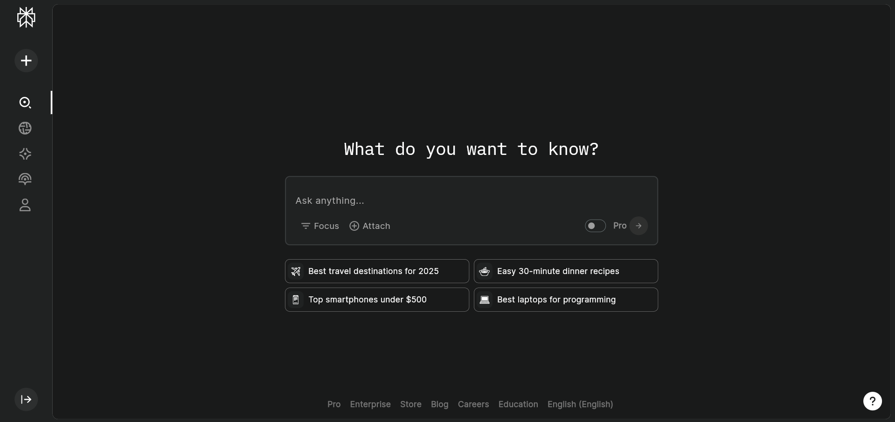
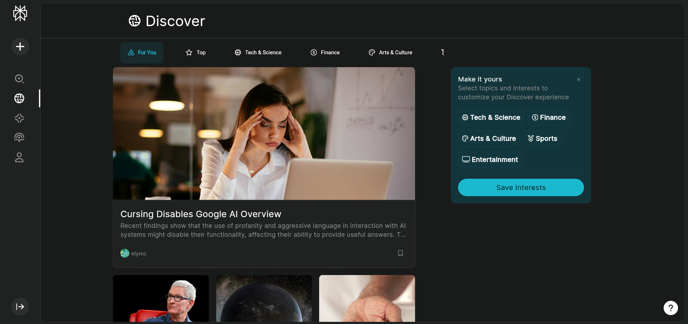
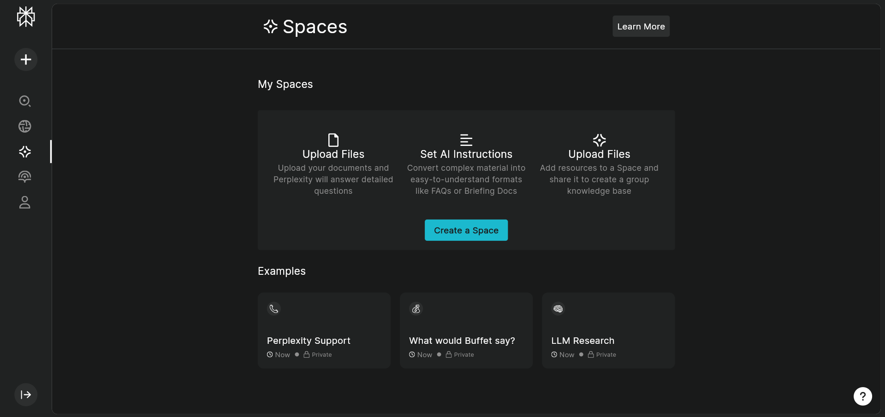
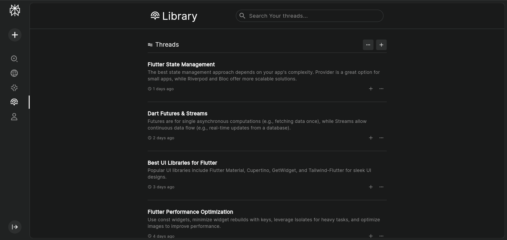

# Perplexity Clone

Perplexity Clone is an AI-powered search application inspired by Perplexity.ai. It allows users to ask questions and get intelligent responses. The project consists of a **Flutter frontend** and a **Fastrack Python backend** implemented based on Ranavt's YouTube tutorial.

## 🚀 Features

### ✅ Implemented Features
- **Home Page Search**: Users can search for queries on the home page.
- **Backend Logic**: Built using **Fastrack Python**, inspired by Ranavt's tutorial.
- **Navigation**: The app has four main pages:
    - 🏠 **Home** (Search working)
    - 🔎 **Discover** (UI ready, backend not integrated yet)
    - 📚 **Library** (UI ready, backend not integrated yet)
    - 🌍 **Spaces** (UI ready, backend not integrated yet)

### 🛠️ Features in Progress
- Enabling search functionality across **Discover, Library, and Spaces** pages.
- Enhancing response formatting for better user experience.
- Adding user authentication and saved searches.

## 🖼️ Screenshots
Screenshots of the app can be found in the `assets/screenshots` folder.

| Home Page | Home Page                               |
|-----------|-----------------------------------------|
|  |  |

| Discover Page                       | Discover Page                               |
|-------------------------------------|---------------------------------------------|
|  |  |

| Spaces Page                         | Spaces Page                               |
|-------------------------------------|-------------------------------------------|
|  |  |

| Library Page | Library Page                               |
|-------------|--------------------------------------------|
|  |  |

## 🏗️ Installation & Setup

### Prerequisites
- **Flutter** (Latest stable version)
- **Dart SDK**
- **Python 3.x** (For Fastrack backend)
- **FastAPI** (`pip install fastapi uvicorn`)

### Backend Setup (Fastrack API)
1. Clone the backend repository (if separate):
   ```sh
   git clone https://github.com/piro-piyush/perplexity_backend>
   cd perplexity_backend
   ```
2. Install dependencies:
   ```python
   pip install -r requirements.txt
   ```
3. Run the backend:
   ```python
   fastapi main.py
   ```

### Frontend Setup (Flutter)
1. Clone this repository:
   ```sh
   git clone https://github.com/piro-piyush/perplexity_clone_frontend
   cd frontend
   ```
2. Install dependencies:
   ```sh
   flutter pub get
   ```
3. Run the application:
   ```sh
   flutter run
   ```

## 🔧 Tech Stack
- **Frontend:** Flutter (Dart)
- **Backend:** FastAPI (Python, Fastrack)
- **State Management:** GetX
- **Networking:** REST API (via FastAPI)

## 🙌 Credits
- **Backend Tutorial by Rivaan Ranawat** (YouTube)
- **Flutter UI & Integration:** Custom-built

## 📌 To-Do List
- [ ] Improve AI response handling
- [ ] Implement search in Discover, Library, and Spaces pages
- [ ] Add authentication system
- [ ] Implement Responsive screens for Mobile

---
Feel free to contribute and enhance the project! 🚀